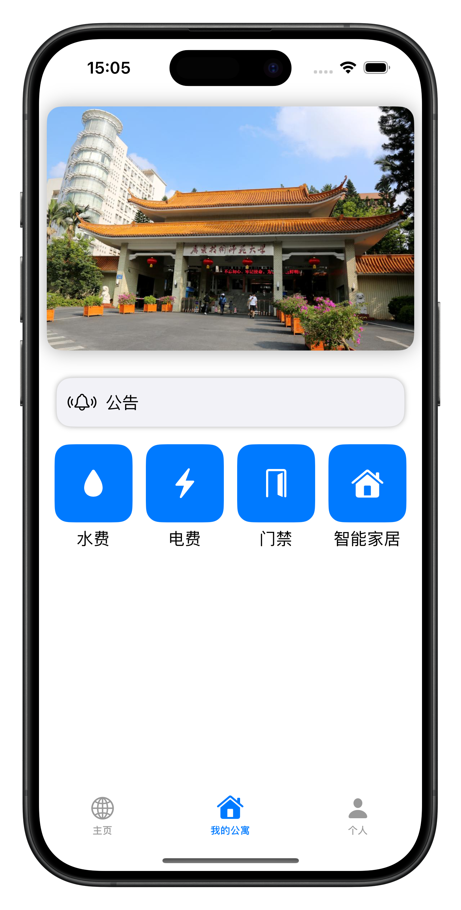
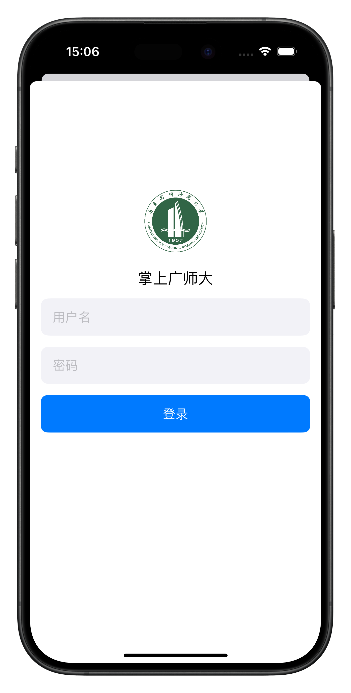
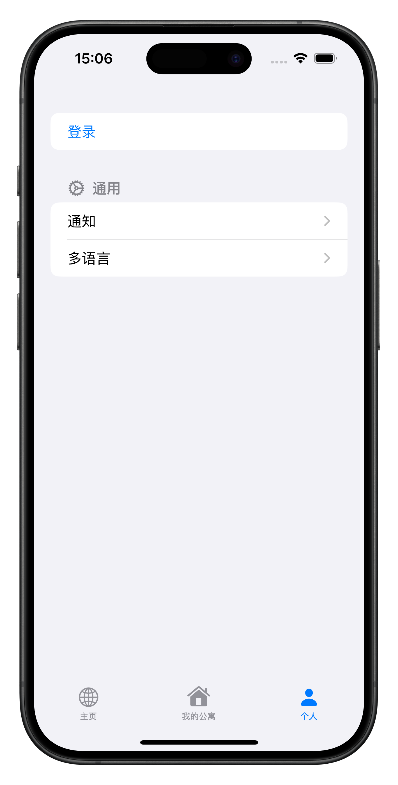
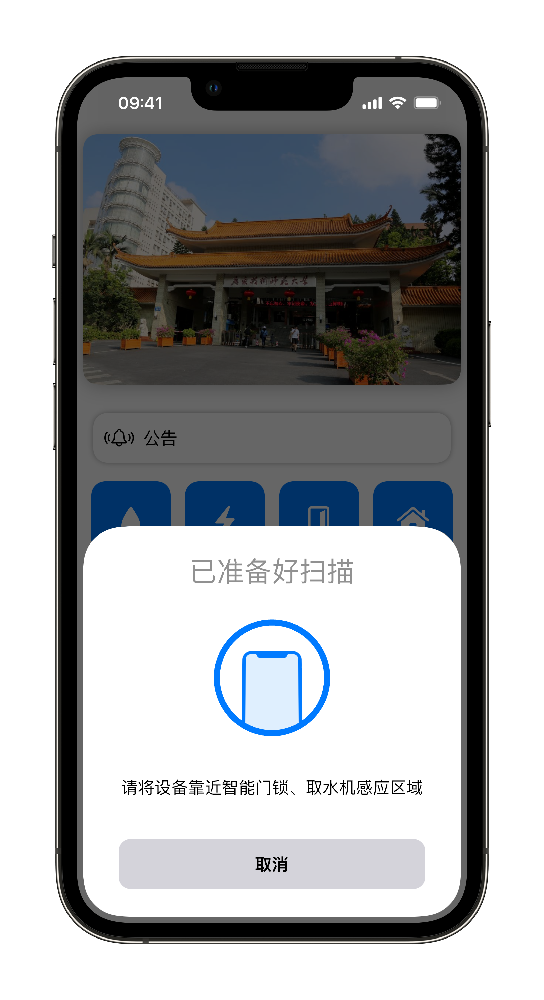
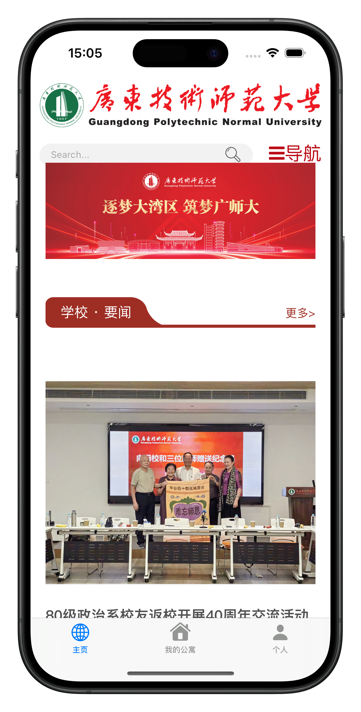
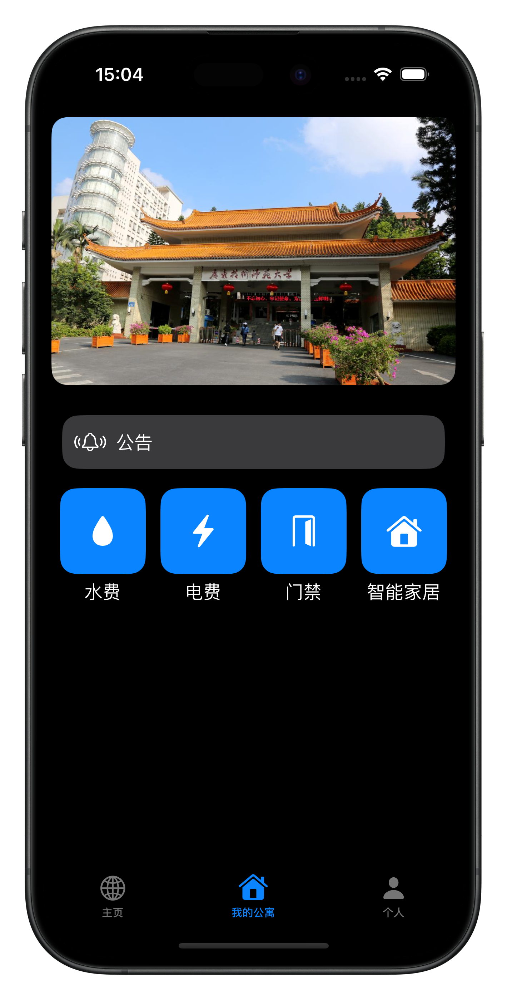
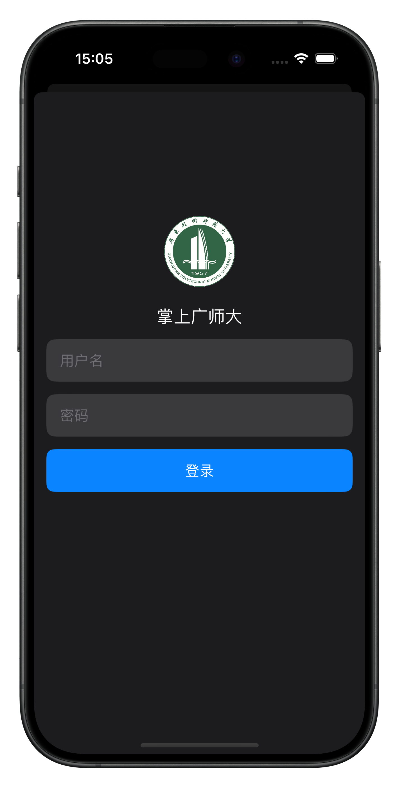
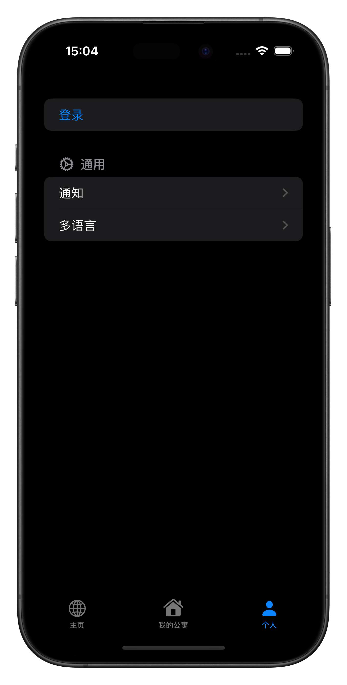

#  学生公寓系统（iOS端）

基于Swift、SwiftUI打造的学生公寓一站式管理服务平台iOS端，支持深色模式

  
  
  
  
  
  
  
  

## 技术栈

Swift、SwiftUI

## 特性
- [x] 最新资讯
- [x] 个人功能
- [x] 深色模式
- [ ] 水电费查询
- [ ] 离线使用
- [ ] NFC门禁
- [ ] 智能家居

## 配套项目

Java后端：https://github.com/betacat-ha/student-apartment-management-system

管理员WEB前端：https://github.com/betacat-ha/student-apartment-management-web

